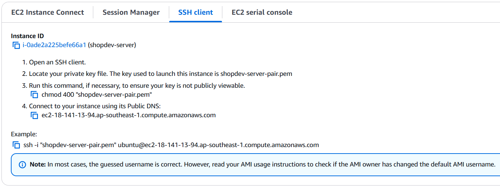

# 🚀 Hướng dẫn khởi tạo EC2 Instance trên AWS

## 🧰 Yêu cầu trước khi bắt đầu
- Đã cấu hình AWS Region (Suggested Singapore)
---

## ✅ Bước 1: Truy cập EC2 Dashboard
1. Đăng nhập vào [AWS Console](https://console.aws.amazon.com/)
2. Trên thanh tìm kiếm, nhập `EC2` và chọn `EC2` service
3. Chọn region muốn khởi tạo EC2 (góc trên bên phải)
---

## ✅ Bước 2: Tạo EC2 Instance
1. Nhấn **Launch Instance**
2. Nhập tên cho EC2 (ví dụ: `shopdev-server`)
3. Chọn AMI:
   - Chọn `Ubuntu 22.04` 
4. Chọn loại instance:
   - Dùng loại miễn phí
5. Key pair (để SSH vào máy):
   - Tạo key mới (`shopdev-server-pair`)
6. Cấu hình tường lửa (Security Group)
    - đổi Security group name - required
7. Nhấn **Launch Instance**
---

## ✅ Bước 3: Kết nối Local tới EC2
1. Truy cập EC2 Dashboard > Instances.
2. Chọn instance > Connect > SSH Client.
3. Copy file shopdev-server-pair.pem từ Windows sang Ubuntu.



Trong terminal Ubuntu, thực hiện các bước sau để connect tới Instance:
```bash
mkdir -p ~/.ssh 
cp /mnt/c/Users/Acer/Downloads/server-shopdev-key-pair.pem ~/.ssh/
chmod 400 ~/.ssh/shopdev-server-pair.pem
ssh -i "~/.ssh/shopdev-server-pair.pem" ubuntu@ec2-18-141-13-94.ap-southeast-1.compute.amazonaws.com
```
---

## ✅ Bước 4: Cài đặt firewall truy cập vào server qua http
1. Truy cập EC2 Dashboard > Instance
2. Tab `Security`
3. `Inbound rules` > `Edit inbound rules`
4. `Add rule` 
   - Type: `Http`
   - Source: `Anywhere-IPv4`
5. `Save rule` 

## ✅ Bước 4: Cài đặt phần mềm (tùy chọn)
Install Nginx
```bash
sudo apt-get update
sudo install nginx
```
---

## ✅ Bước 5: Truy cập Website
Mở trình duyệt và truy cập:
Public IPv4 DNS
```
ec2-18-141-13-94.ap-southeast-1.compute.amazonaws.com 
```

---

