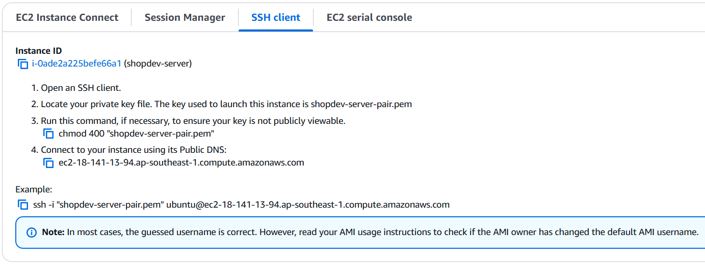

# 🚀 Hướng dẫn khởi tạo EC2 Instance trên AWS

## 🧰 Yêu cầu trước khi bắt đầu
- Đã cấu hình AWS Region (Suggested Singapore)
---

## ✅ Bước 1: Truy cập EC2 Dashboard
1. Đăng nhập vào [AWS Console](https://console.aws.amazon.com/)
2. Trên thanh tìm kiếm, nhập `EC2` và chọn `EC2` service
3. Chọn region muốn khởi tạo EC2 (góc trên bên phải)
---

## ✅ Bước 2: Tạo EC2 Instance
1. Nhấn **Launch Instance**
2. Nhập tên cho EC2 (ví dụ: `shopdev-server`)
3. Chọn AMI:
   - Chọn `Ubuntu 22.04` 
4. Chọn loại instance:
   - Dùng loại miễn phí
5. Key pair (để SSH vào máy):
   - Tạo key mới (`shopdev-server-pair`)
6. Cấu hình tường lửa (Security Group)
    - đổi Security group name - required
7. Nhấn **Launch Instance**
---

## ✅ Bước 3: Kết nối Local tới EC2
1. Truy cập EC2 Dashboard > Instances.
2. Chọn instance > Connect > SSH Client.
3. Copy file shopdev-server-pair.pem từ Windows sang Ubuntu.




Trong terminal Ubuntu, thực hiện các bước sau:
```bash
mkdir -p ~/.ssh 
cp /mnt/c/Users/Acer/Downloads/server-shopdev-key-pair.pem ~/.ssh/
chmod 400 ~/.ssh/shopdev-server-pair.pem
ssh -i "~/.ssh/shopdev-server-pair.pem" ubuntu@ec2-18-141-13-94.ap-southeast-1.compute.amazonaws.com
```
---

## ✅ Bước 4: Cài đặt phần mềm (tùy chọn)

Ví dụ: Cài đặt Apache trên Amazon Linux
```bash
sudo yum update -y
sudo yum install httpd -y
sudo systemctl start httpd
sudo systemctl enable httpd
```

---

## ✅ Bước 5: Truy cập Website

Mở trình duyệt và truy cập:
```
http://<EC2-PUBLIC-IP>
```

---

## 📌 Mẹo & Ghi chú

- Bạn có thể gán **Elastic IP** để EC2 không đổi IP khi restart.
- Đừng chia sẻ file `.pem` hoặc `.ppk` công khai.
- Tắt hoặc terminate instance khi không dùng để tránh mất phí.
